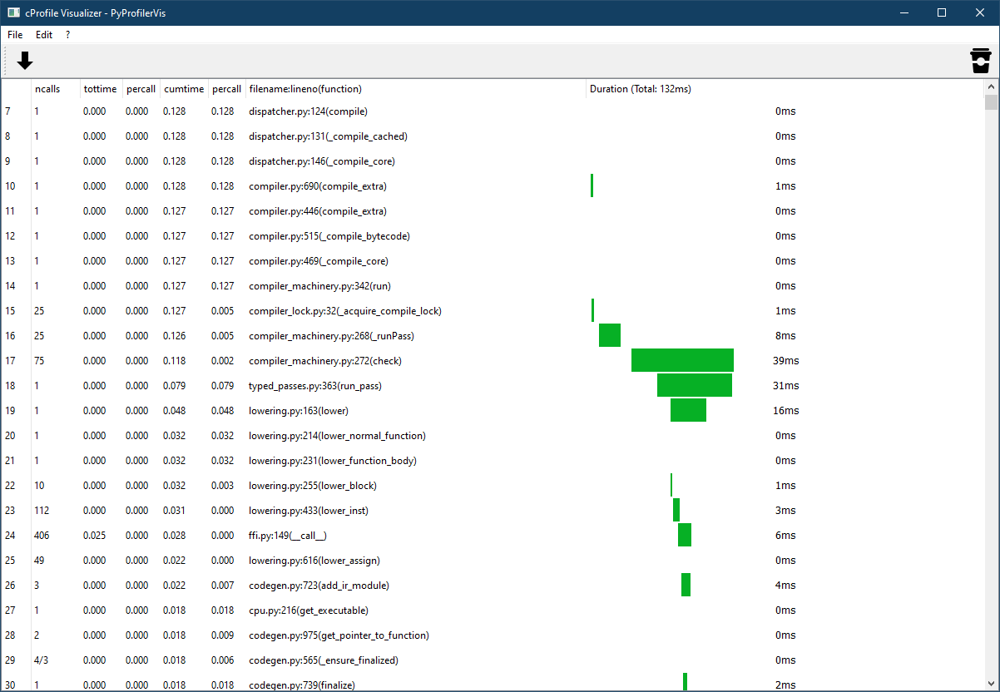

# cProfile visualizer


This project provides a simple PyQt5 application to display a task progress time-table. The table includes columns for ID, task name, assignee, score, and time percentage. Users can easily update and customize the table with their own data.


# Installation
To install the required dependencies, run:
```bash
$ pip install -r requirements.txt
```

## Usage
To run the application, execute the following command:
```python
python main.py
```

On the toolbar click on the Arrow icon to import a logfile. It needs to have this format:
```
   ncalls  tottime  percall  cumtime  percall filename:lineno(function)
        1    0.000    0.000    0.132    0.132 timeit.py:164(timeit)
        1    0.000    0.000    0.132    0.132 <timeit-src>:2(inner)
        1    0.000    0.000    0.132    0.132 benchmark.py:92(<lambda>)
        1    0.000    0.000    0.132    0.132 numba_jit_method.py:56(process)
        1    0.000    0.000    0.128    0.128 dispatcher.py:388(_compile_for_args)
        1    0.000    0.000    0.128    0.128 dispatcher.py:915(compile)
```

you can import `testfile.txt` for testing.
## Exa

# Contributing
Contributions are welcome! If you'd like to contribute, please submit a pull request or open an issue.

# License
Released under the [MIT-License](./LICENSE)